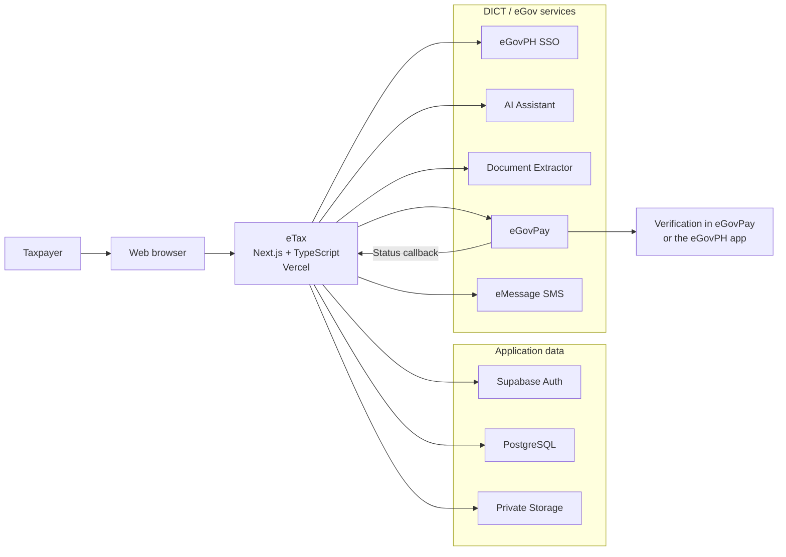
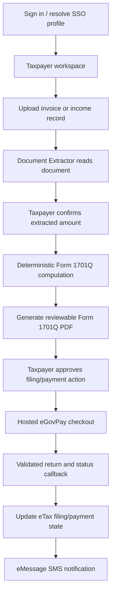
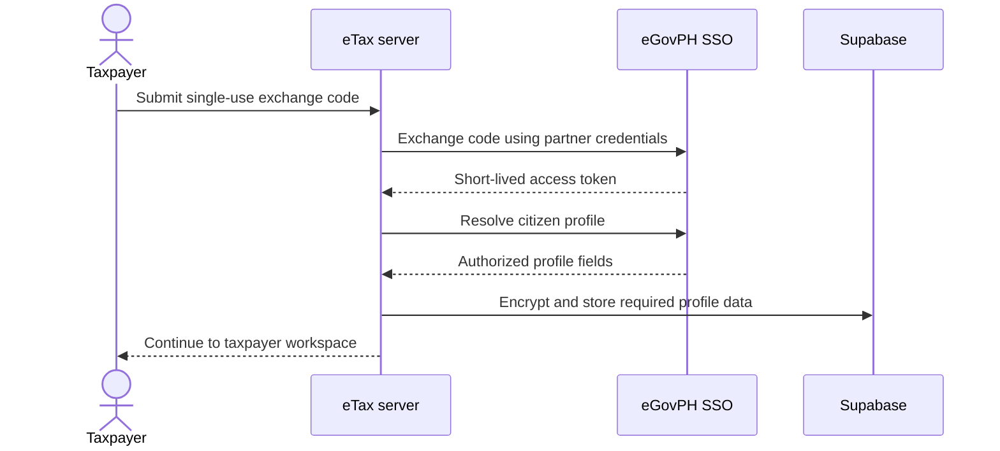
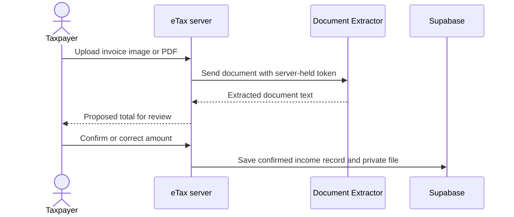
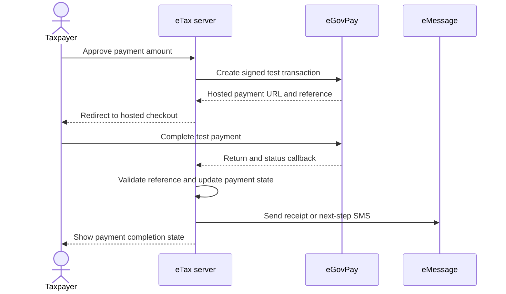

# eTax

eTax is a web application that helps Filipino self-employed taxpayers organize
income records, review supported quarterly tax computations, generate a BIR
Form 1701Q PDF, complete a hosted eGovPay test transaction, and receive filing
or payment notifications.

The project integrates eGovPH services for identity, document extraction,
citizen assistance, payments, and SMS messaging. All service calls originate
from server-side application code; API credentials are never sent to the
browser.

## Core Flow

1. Sign in with the seeded demo account or resolve an eGovPH SSO exchange code.
2. Create a taxpayer workspace and complete the tax profile.
3. Upload income records and use the Document Extractor to read invoice totals.
4. Review the supported BIR Form 1701Q computation and generate the PDF.
5. Approve filing actions and, when applicable, open the hosted eGovPay checkout.
6. Track filing/payment status and send eMessage SMS notifications.

## System Architecture

### High-Level Architecture



All eGov credentials are server-side environment variables. The browser only
communicates with eTax routes and the hosted eGovPay page; it never receives API
tokens or partner secrets.

### User and Data Flow



AI extraction proposes document values; it does not silently create confirmed
tax records. The taxpayer reviews and confirms the amount before it becomes an
input to the deterministic computation.

### eGov Integration Sequences

#### SSO



#### Document Extraction



#### Payment and Notification



### Architecture Source Map

| Concern | Implementation |
| --- | --- |
| SSO token/profile calls | `lib/egov-sso/client.ts` |
| AI Assistant | `lib/egov/ai-assistant.ts` |
| Document Extractor | `lib/egov/document-extractor.ts` |
| eGovPay transaction creation | `lib/egovpay/client.ts` |
| eGovPay callback and return | `app/api/egovpay/` |
| eMessage SMS | `lib/emessage/sms.ts` |
| Tax computation | `lib/tax/` |
| Form 1701Q generation | `lib/pdf/1701q/` and `app/api/filing/pdf/` |

For standalone visual views, see the
[full architecture](docs/architecture/etax-full-architecture.html) or
[simplified architecture](docs/architecture/etax-simple-architecture.html).

## Technology

- Next.js 16 App Router and React 19
- TypeScript
- Tailwind CSS
- Supabase Auth, PostgreSQL, and Storage
- `pdf-lib` for BIR Form 1701Q generation
- `okapibm25` for local eTax help-document retrieval
- Vercel-compatible server deployment

Exact installed versions are recorded in `package-lock.json`.

## Prerequisites

- Node.js 20.9 or newer
- npm
- Supabase CLI for local database development
- An eGov API Developer Portal account with active credentials for each catalog
  used by the application

## Local Setup

1. Install the locked dependency versions:

```bash
npm ci
```

2. Create a local environment file:

```bash
cp .env.example .env.local
```

3. Populate `.env.local` with your Supabase configuration and the full HTTPS
   endpoint URLs and active credentials shown in the eGov API Developer Portal.
   Do not commit this file.

4. Start Supabase and apply all migrations and seed data:

```bash
supabase start
supabase db reset
```

For a linked hosted project, review the target project before running:

```bash
supabase db push
```

5. Start eTax:

```bash
npm run dev
```

Open `http://localhost:3000`.

## Environment Configuration

### Application and Supabase

| Variable | Purpose |
| --- | --- |
| `NEXT_PUBLIC_SUPABASE_URL` | Supabase project URL exposed to the browser client |
| `NEXT_PUBLIC_SUPABASE_ANON_KEY` | Supabase anonymous client key |
| `SUPABASE_SERVICE_ROLE_KEY` | Server-only administrative key used by trusted application code |
| `APP_BASE_URL` | Public eTax origin used to build eGovPay callback and return URLs |
| `PII_ENCRYPTION_KEY` | Base64-encoded 32-byte AES-256-GCM key for protected SSO profile fields |

Generate the PII encryption key with:

```bash
openssl rand -base64 32
```

### eGov API Developer Portal

Copy the complete endpoint URL from the corresponding API catalog. Do not infer
or reuse a legacy hostname.

| Catalog | Endpoint variables | Credential variables |
| --- | --- | --- |
| eGovPH SSO | `EGOV_SSO_TOKEN_URL`, `EGOV_SSO_PROFILE_URL` | `EGOV_SSO_PARTNER_CODE`, `EGOV_SSO_PARTNER_SECRET` |
| eGov AI | `EGOV_AI_TOKEN_URL`, `EGOV_AI_ASSISTANT_URL`, `EGOV_AI_DOCUMENT_EXTRACTOR_URL` | `EGOV_AI_ACCESS_CODE` or `EGOV_AI_ACCESS_TOKEN` |
| eGovPay | `EGOVPAY_TRANSACTION_URL` | `EGOVPAY_API_TOKEN`, `EGOVPAY_SETTLEMENT_TEMPLATE_UUID` |
| eMessage | `EMESSAGE_SMS_PUSH_URL` | `EMESSAGE_ACCESS_TOKEN` |

Additional settings:

| Variable | Purpose |
| --- | --- |
| `EGOV_SSO_ALLOW_STORED_FALLBACK` | Allows the demo SSO flow to reuse its stored profile when a new single-use exchange code is unavailable |
| `EGOV_SSO_IMAGE_HOSTS` | Comma-separated HTTPS hostnames allowed for remote SSO profile images |
| `EMESSAGE_TEST_NUMBER` | Explicit test recipient used by the reminder simulation script |

Developer Portal secrets are displayed only once. Store them in an approved
secret manager and in the deployment environment; never place them in source,
screenshots, logs, or the demonstration video.

## Demo Account

The local seed creates a disposable account containing only demonstration data:

```text
Email: demo@etax.local
Password: DemoPass123!
```

Do not reuse these credentials or seed data for a real taxpayer.

## Verification

```bash
npm test
npm run typecheck
npm run lint
npm run build
```

The SMS reminder workflow can be exercised without changing the system clock:

```bash
npm run simulate:sms-reminders -- --help
```

For final integration verification, confirm successful requests in the eGov API
Developer Portal usage logs and check the remaining credit balance.

## Repository Structure

```text
app/                 Next.js routes, server actions, and API callbacks
components/          Application UI components
docs/                Architecture and user-facing assistant knowledge
lib/                 Tax, PDF, Supabase, and eGov integration modules
public/              Static application and BIR form assets
scripts/             Seed and controlled simulation utilities
supabase/migrations/ Database schema history
tests/               Node test suite
```

## Product Boundary

The current implementation supports the configured Form 1701Q workflow and
eGovPay test-mode payment handoff. Filing and payment state are recorded in
eTax, while payment completion is confirmed through the configured eGovPay
callback/return flow. The repository does not contain a direct BIR production
filing endpoint, does not cover every taxpayer category or tax form, and does
not replace professional legal or tax advice.
