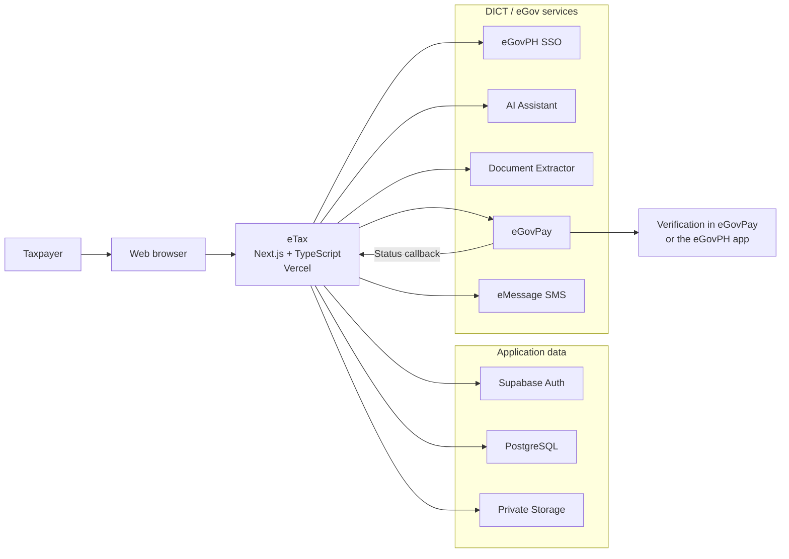
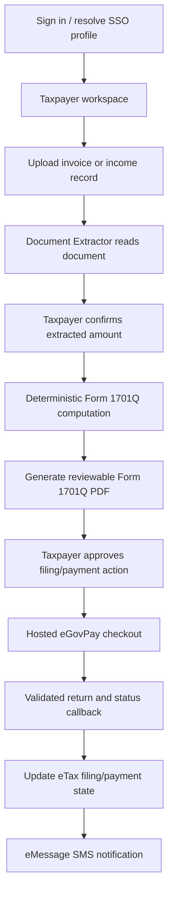
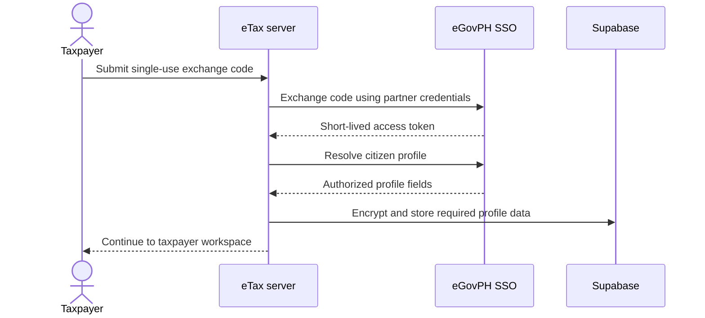
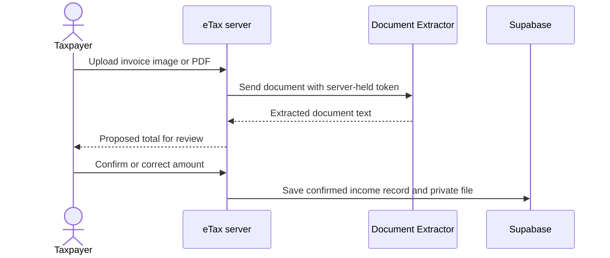
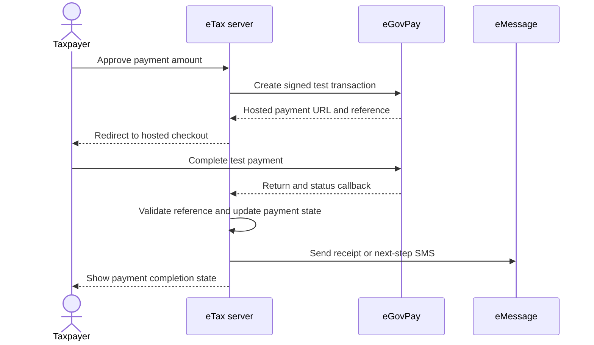

# eTax System Architecture

## High-Level Architecture

All eGov credentials are server-side environment variables. The browser only
communicates with eTax routes and the hosted eGovPay page; it never receives API
tokens or partner secrets.

## User and Data Flow

AI extraction proposes document values; it does not silently create confirmed
tax records. The taxpayer reviews and confirms the amount before it becomes an
input to the deterministic computation.

## eGov Integration Sequences

### SSO

### Document Extraction

### Payment and Notification

## Source Locations

| Concern | Implementation |
| --- | --- |
| SSO token/profile calls | `lib/egov-sso/client.ts` |
| AI Assistant | `lib/egov/ai-assistant.ts` |
| Document Extractor | `lib/egov/document-extractor.ts` |
| eGovPay transaction creation | `lib/egovpay/client.ts` |
| eGovPay callback and return | `app/api/egovpay/` |
| eMessage SMS | `lib/emessage/sms.ts` |
| Tax computation | `lib/tax/` |
| Form 1701Q generation | `lib/pdf/1701q/` and `app/api/filing/pdf/` |

The original visual versions are also included for local viewing:

- [Full architecture](etax-full-architecture.html)
- [Simplified architecture](etax-simple-architecture.html)
